# Project Next Hono SQLite

Nx monorepo with Next.js frontend (Vercel) + Hono.js backend (Cloudflare Workers) + D1 database (SQLite).

```mermaid
graph TB
    subgraph "Development Environment"
        DEV[Developer]
    end

    subgraph "Nx Monorepo"
        subgraph "apps/frontend"
            FE[Next.js 15<br/>App Router]
            API_CLIENT[API Client<br/>lib/api-client.ts]
            FE --> API_CLIENT
        end

        subgraph "apps/backend"
            BE[Hono.js API<br/>index.ts]
            ROUTES[API Routes<br/>/api/health<br/>/api/items]
            DB_ACCESS[D1 Database<br/>Access Layer]
            BE --> ROUTES
            ROUTES --> DB_ACCESS
        end

        subgraph "packages/shared-types"
            TYPES[TypeScript Types<br/>Item, ApiResponse<br/>Request/Response Types]
        end

        TYPES -.->|imports| API_CLIENT
        TYPES -.->|imports| ROUTES
    end

    subgraph "Local Database"
        LOCAL_D1[(Local D1<br/>SQLite)]
        SCHEMA[schema.sql<br/>items table]
        SCHEMA -.->|defines| LOCAL_D1
    end

    subgraph "Production - Vercel"
        VERCEL[Vercel<br/>Next.js Frontend<br/>:3000 dev]
    end

    subgraph "Production - Cloudflare"
        WORKER[Cloudflare Workers<br/>Hono.js API<br/>:8787 dev]
        PROD_D1[(D1 Database<br/>SQLite)]
        WORKER --> PROD_D1
    end

    DEV -->|pnpm dev| FE
    DEV -->|pnpm dev| BE
    API_CLIENT -->|HTTP Requests<br/>NEXT_PUBLIC_API_URL| ROUTES
    DB_ACCESS -->|SQL Queries| LOCAL_D1

    FE -.->|pnpm build:frontend<br/>nx build frontend| VERCEL
    BE -.->|pnpm deploy:backend<br/>nx deploy backend| WORKER

    style FE fill:#0070f3
    style BE fill:#ff6b35
    style TYPES fill:#3178c6
    style LOCAL_D1 fill:#44a8b3
    style PROD_D1 fill:#44a8b3
    style VERCEL fill:#000
    style WORKER fill:#f38020
```

## Architecture



## Commands

### Development
```bash
pnpm dev              # Run both frontend and backend
pnpm dev:frontend     # Frontend only (localhost:3000)
pnpm dev:backend      # Backend only (localhost:8787)
```

### Build
```bash
pnpm build            # Build all applications
pnpm build:frontend   # Build frontend only
```

### Testing & Linting
```bash
pnpm test             # Run tests
pnpm lint             # Run linters
```

### Database
```bash
pnpm db:create        # Create D1 database
pnpm db:generate      # Generate migrations from schema
pnpm db:migrate:local # Apply migrations locally
pnpm db:migrate       # Apply migrations to production
```

### Deployment
```bash
pnpm deploy:backend   # Deploy to Cloudflare Workers
```

### Package Management

This monorepo uses separate `package.json` files for each app. Install dependencies using filters:

```bash
# Install to frontend
pnpm add <package> --filter frontend
pnpm add -D <package> --filter frontend  # dev dependency

# Install to backend
pnpm add <package> --filter backend
pnpm add -D <package> --filter backend   # dev dependency

# Install to workspace root (shared tooling only)
pnpm add -D <package> -w
```

## Structure

```
apps/
├── frontend/       # Next.js 15 → Vercel
└── backend/        # Hono.js → Cloudflare Workers
packages/
└── shared-types/   # Shared TypeScript types
```

## Tech Stack

- Nx + pnpm
- Next.js 15 (App Router)
- Hono.js + OpenAPI
- Drizzle ORM + Cloudflare D1 (SQLite)
- TypeScript + Zod validation

## Environment Variables

**Frontend** (`apps/frontend/.env.local`):
```bash
NEXT_PUBLIC_API_URL=http://localhost:8787
```

**Backend** (`apps/backend/wrangler.toml`):
```toml
[[d1_databases]]
binding = "DB"
database_name = "next-hono-sqlite"
database_id = "your-database-id"
```

## API Endpoints

- `GET /docs` - Swagger UI
- `GET /` - Health check
- `GET /api/health` - Detailed health
- `GET /api/items` - List items
- `POST /api/items` - Create item
- `DELETE /api/items/:id` - Delete item
- `GET /api/fruits` - List fruits
- `GET /api/fruits/:id` - Get fruit
- `POST /api/fruits` - Create fruit
- `PUT /api/fruits/:id` - Update fruit
- `DELETE /api/fruits/:id` - Delete fruit

## License

ISC
