# Project Next Hono SQLite

A modern monorepo built with Nx, featuring a Next.js frontend and Hono.js backend on Cloudflare Workers with D1 database.

## Application Architecture

```mermaid
graph TB
    subgraph "Development Environment"
        DEV[Developer]
    end

    subgraph "Nx Monorepo"
        subgraph "apps/frontend"
            FE[Next.js 15<br/>App Router]
            API_CLIENT[API Client<br/>lib/api-client.ts]
            FE --> API_CLIENT
        end

        subgraph "apps/backend"
            BE[Hono.js API<br/>index.ts]
            ROUTES[API Routes<br/>/api/health<br/>/api/items]
            DB_ACCESS[D1 Database<br/>Access Layer]
            BE --> ROUTES
            ROUTES --> DB_ACCESS
        end

        subgraph "packages/shared-types"
            TYPES[TypeScript Types<br/>Item, ApiResponse<br/>Request/Response Types]
        end

        TYPES -.->|imports| API_CLIENT
        TYPES -.->|imports| ROUTES
    end

    subgraph "Local Database"
        LOCAL_D1[(Local D1<br/>SQLite)]
        SCHEMA[schema.sql<br/>items table]
        SCHEMA -.->|defines| LOCAL_D1
    end

    subgraph "Production - Vercel"
        VERCEL[Vercel<br/>Next.js Frontend<br/>:3000 dev]
    end

    subgraph "Production - Cloudflare"
        WORKER[Cloudflare Workers<br/>Hono.js API<br/>:8787 dev]
        PROD_D1[(D1 Database<br/>SQLite)]
        WORKER --> PROD_D1
    end

    DEV -->|pnpm dev| FE
    DEV -->|pnpm dev| BE
    API_CLIENT -->|HTTP Requests<br/>NEXT_PUBLIC_API_URL| ROUTES
    DB_ACCESS -->|SQL Queries| LOCAL_D1

    FE -.->|pnpm build:frontend<br/>nx build frontend| VERCEL
    BE -.->|pnpm deploy:backend<br/>nx deploy backend| WORKER

    style FE fill:#0070f3
    style BE fill:#ff6b35
    style TYPES fill:#3178c6
    style LOCAL_D1 fill:#44a8b3
    style PROD_D1 fill:#44a8b3
    style VERCEL fill:#000
    style WORKER fill:#f38020
```



## Architecture

```
project-next-hono-sqlite/
├── apps/
│   ├── frontend/          # Next.js application (→ Vercel)
│   └── backend/           # Hono.js API (→ Cloudflare Workers)
├── packages/
│   └── shared-types/      # Shared TypeScript types
└── plan/                  # Implementation plans
```

## Tech Stack

- **Monorepo**: Nx with pnpm
- **Frontend**: Next.js 15 (App Router) → Deployed to Vercel
- **Backend**: Hono.js → Deployed to Cloudflare Workers
- **Database**: Cloudflare D1 (SQLite)
- **Language**: TypeScript

## Prerequisites

- Node.js 18+
- pnpm 10+
- Cloudflare account (for deployment)
- Vercel account (for deployment)

## Getting Started

### 1. Install Dependencies

```bash
pnpm install
```

### 2. Setup Cloudflare D1 Database

Create a D1 database:

```bash
pnpm db:create
```

This will output database credentials. Update `apps/backend/wrangler.toml` with the database information:

```toml
[[d1_databases]]
binding = "DB"
database_name = "backend-db"
database_id = "your-database-id-here"
```

### 3. Run Migrations

For local development:

```bash
pnpm db:migrate:local
```

For production:

```bash
pnpm db:migrate
```

### 4. Start Development Servers

Run both frontend and backend:

```bash
pnpm dev
```

Or run them separately:

```bash
# Frontend only (runs on http://localhost:3000)
pnpm dev:frontend

# Backend only (runs on http://localhost:8787)
pnpm dev:backend
```

## Available Scripts

### Development

- `pnpm dev` - Run both frontend and backend in parallel
- `pnpm dev:frontend` - Run only the Next.js frontend
- `pnpm dev:backend` - Run only the Hono.js backend

### Build

- `pnpm build` - Build all applications
- `pnpm build:frontend` - Build only the frontend

### Database

- `pnpm db:create` - Create a new D1 database
- `pnpm db:migrate` - Run migrations on production database
- `pnpm db:migrate:local` - Run migrations on local database

### Deployment

- `pnpm deploy:backend` - Deploy backend to Cloudflare Workers

## Project Structure

### Frontend (`apps/frontend`)

Next.js application with:
- App Router
- TypeScript
- CSS Modules
- API route examples

**Environment Variables:**
- `NEXT_PUBLIC_API_URL` - Backend API URL (default: `http://localhost:8787`)

### Backend (`apps/backend`)

Hono.js API with:
- CORS configured
- D1 database integration
- RESTful API endpoints
- TypeScript

**Endpoints:**
- `GET /` - Health check
- `GET /api/health` - Detailed health status
- `GET /api/items` - List all items
- `POST /api/items` - Create a new item
- `DELETE /api/items/:id` - Delete an item

### Shared Types (`packages/shared-types`)

Common TypeScript types shared between frontend and backend:
- API request/response types
- Database models
- Utility types

## Deployment

### Frontend to Vercel

1. Connect your repository to Vercel
2. Configure build settings:
   - **Build Command**: `pnpm nx build frontend`
   - **Output Directory**: `dist/apps/frontend/.next`
   - **Install Command**: `pnpm install`
3. Add environment variables:
   - `NEXT_PUBLIC_API_URL` - Your Cloudflare Worker URL

Or use the Vercel CLI:

```bash
cd apps/frontend
vercel
```

### Backend to Cloudflare Workers

1. Login to Cloudflare:

```bash
cd apps/backend
pnpm wrangler login
```

2. Deploy:

```bash
pnpm deploy:backend
```

3. Update your frontend's `NEXT_PUBLIC_API_URL` with the deployed Worker URL

## Development Workflow

1. **Make changes** to frontend, backend, or shared types
2. **Hot reload** is enabled for both apps during development
3. **Type safety** is enforced across the monorepo
4. **Nx caching** speeds up builds and tests

## Database Schema

The default schema includes an `items` table:

```sql
CREATE TABLE items (
  id INTEGER PRIMARY KEY AUTOINCREMENT,
  name TEXT NOT NULL,
  description TEXT,
  created_at DATETIME DEFAULT CURRENT_TIMESTAMP,
  updated_at DATETIME DEFAULT CURRENT_TIMESTAMP
);
```

See `apps/backend/src/db/schema.sql` for the full schema.

## Nx Commands

```bash
# Show project graph
nx graph

# Run a specific target
nx <target> <project>

# Example: nx serve frontend
# Example: nx build backend

# Run targets on all projects
nx run-many -t <target> --all

# Run targets on affected projects only
nx affected -t <target>
```

## Environment Files

- `apps/frontend/.env.local` - Frontend environment variables (git-ignored)
- `apps/backend/.dev.vars` - Backend environment variables (git-ignored)
- `.env.*.example` - Example environment files (committed)

## Troubleshooting

### Frontend can't connect to backend

Ensure the backend is running and `NEXT_PUBLIC_API_URL` is set correctly:

```bash
# .env.local
NEXT_PUBLIC_API_URL=http://localhost:8787
```

### Database errors

1. Ensure D1 database is created and configured in `wrangler.toml`
2. Run migrations: `pnpm db:migrate:local`
3. Check database binding name matches in code (`DB`)

### Build scripts warnings

If you see build script warnings from pnpm, approve them:

```bash
pnpm approve-builds
```

## Contributing

1. Create a feature branch
2. Make your changes
3. Test locally
4. Submit a pull request

## License

ISC
